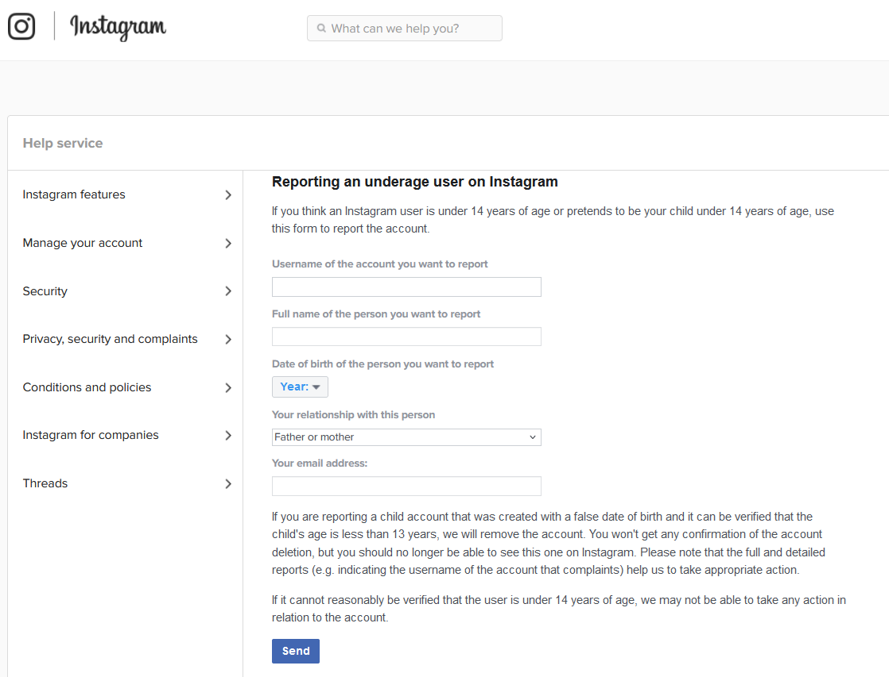

# MASSACRE-IG
## ⚠️ Disclaimer

This project is for **educational purposes only**. Misuse of this script to violate the terms and policies of any platform, including Instagram, is prohibited. The author is not responsible for any misuse or consequences.

 

---

# Instagram Report v1 🚨

A Python script designed for automating the submission of reports to Instagram's support form. This tool is built for educational purposes and highlights the importance of understanding APIs and headers.

## Example Output 🖥️

```
[+] Victim UserName : target_username
[+] Victim Name : John Doe
=======================================
[√] Done Report : 1 | target_username
[×] Error Code : 403
```

---

## Important Notes 📝

- The script uses hardcoded headers and data fields required by Instagram's support form.
- Ensure to use this responsibly and within the bounds of ethical usage.
